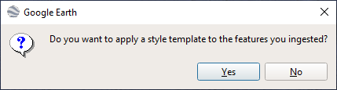
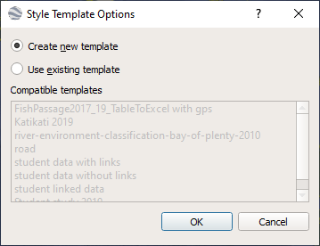
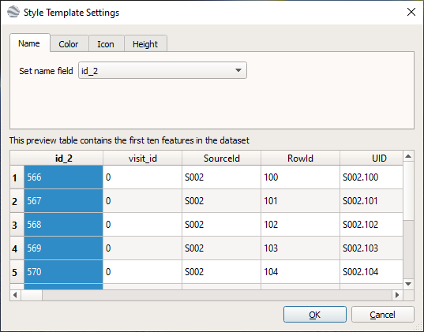
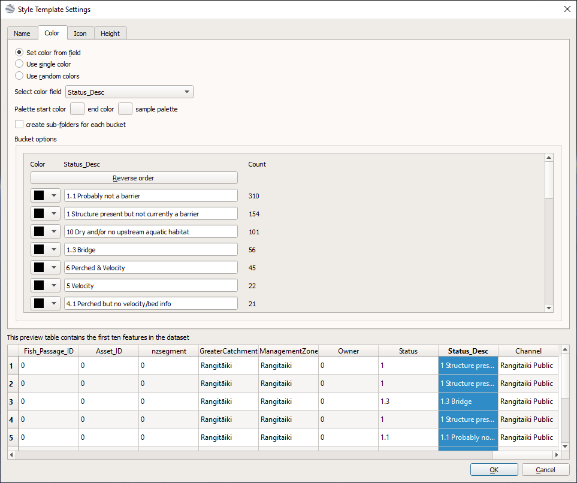
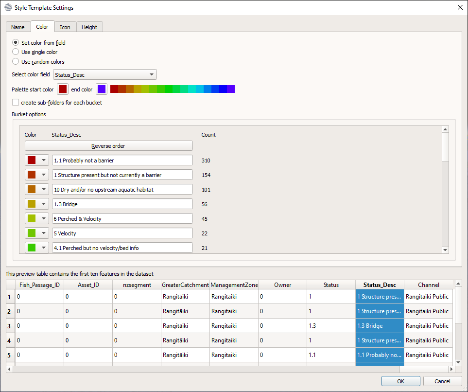
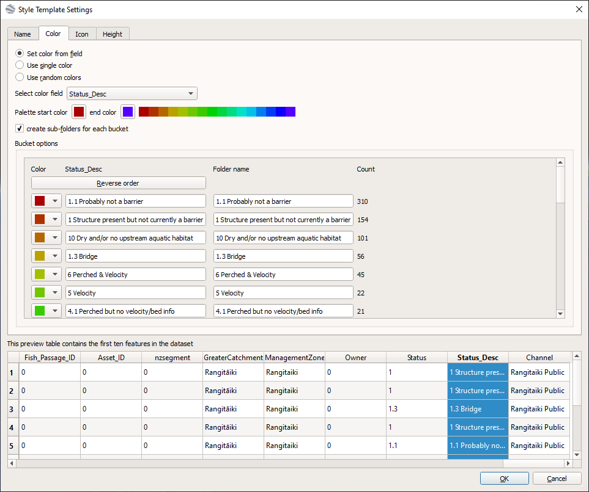
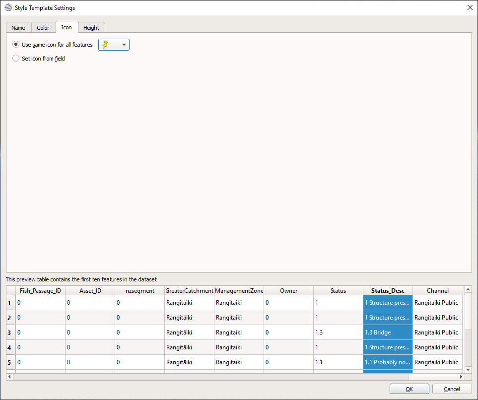
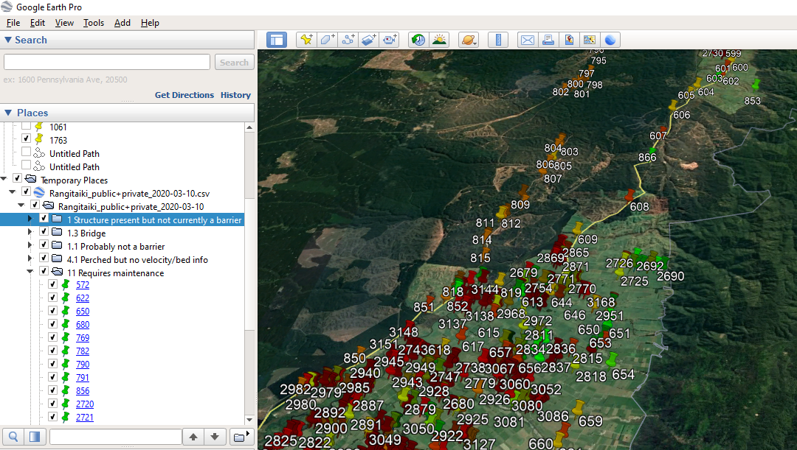
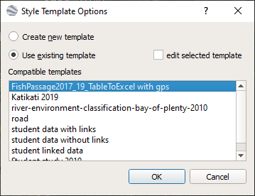

# Google Earth How-to Guide
<!-- TOC -->

- [Google Earth How-to Guide](#google-earth-how-to-guide)
  - [How to Create Folders From a CSV File](#how-to-create-folders-from-a-csv-file)

<!-- /TOC -->
## How to Create Folders From a CSV File

1. Use the Data Import Wizard to import the CSV file into Google Earth

  I assume that you know how to do this already

1. Create a new style template
   - After pressing "Finish" on the Data Import Wizard you will be asked if you want to apply a style template. Select Yes.
        

   - On the next window select "Create new template" and press OK

        

   - Set the name field, this is the value that will appear beside the icons in the map, and in the left hand side of the Google Earth window. This is likely to be an id field. I have selected id_2 in this screenshot
        

   - select the "Color" tab
   - select the "Set color from field" option
   - this will make the "Select color field" drop-down appear, click on the arrow, and from the list of fields displayed select the one you want to use to create folders from. In the screenshot below I selected Status_Desc.
        

   - select the range of colours to use for the icons by clicking in the box next to "Palette start color" and "end color". You can leave as the default which will make all the icons black (as you can see in the "Bucket Options" part of the window above), or choose a single colour for both start and end, or if you want a good range to choose from use red for the start colour and violet for the end colour, as per the screenshot below. This will fill in colours for the buckets but you can change these by selecting the drop-down next to each bucket
        

   - select the "create sub-folders for each bucket" option, this will make the "Folder name" options appear in the "Bucket options" part of the window. Type in a folder name inside each box. These are the names that will appear on the left-hand side of the Google Earth window. In the screenshot below I copied the folder names from the Status_Desc values
        

   - Click on the "Icon" tab and select the icon you want to use for the map. Probably best to use the "Use same icon for all features" option, but you can choose to have different icons depending on the values of a field by selecting the "Set icon from field" option. In the screenshot below I am using the standard pin icon for all features
        

   - Press OK and save the template. Save into the default folder, and use a meaningful file name to make it easier to find it if you want to re-use later.

   - the map is then displayed with the folders, colours and icons as specified above:
        

3. Re-using the Template
  If you wish to reuse the same options for another CSV file:
   - import the CSV file as normal
   - after pressing "Finish" on the Data Import Wizard you will be asked if you want to apply a style template. Select Yes, and select the required template from the list.

        


4. Amending folder names, colours and icons

   - You can amend the folder names, colours, icons etc as normal in Google Earth. Right-click on a folder or feature and select Properties (or if just renaming select Rename). However this will just amend for the current map.
   - If you wish to amend the template for re-use then use the "edit selected template" option in the screenshot above. You can then change as per the creating a new style template section above.
   - or if you are feeling brave, and want to change something like the icon colours to something outside the range specified in the template then you can directly edit the template file you created:
      - Use File Explorer and navigate to folder where you saved the template, it is probably "C:\Users\<your user name>\AppData\LocalLow\Google\GoogleEarth\My Style Templates
      - Locate the template file, and open with a text editor, like Notepad or Wordpad.
      - The template is stored as XML:
      ```
      <?xml version="1.0" encoding="UTF-8"?>
      <kml xmlns="http://www.opengis.net/kml/2.2" xmlns:gx="http://www.google.com/kml/ext/2.2" xmlns:kml="http://www.opengis.net/kml/2.2" xmlns:atom="http://www.w3.org/2005/Atom">
      <Theme>
      	<name>status_folders</name>
      	<nameMapping>
      		<SimpleFieldMapping_string><field>id_2</field>
      </SimpleFieldMapping_string>
      	</nameMapping>
      	<colorMapping>
      		<BucketFieldMapping_string_int>
      			<field>Status_Desc</field>
      			<discrete>1</discrete>
      			<buckets>
      				<Bucket_string_int>
      					<minBound>1.1 Probably not a barrier</minBound>
      					<maxBound>1.1 Probably not a barrier</maxBound>
      					<value>0</value>
      				</Bucket_string_int>
      				<Bucket_string_int>
      					<minBound>1 Structure present but not currently a barrier</minBound>
      					<maxBound>1 Structure present but not currently a barrier</maxBound>
      					<value>1</value>
      ```

      when editing make sure that you do not change any of the tags (things inside the "<" ">" symbols)

    - for example to change the colours scroll down to the palette section, and change the hexadecimal values as required
    ```
      <ThemePalette>
        <entries>ff0000aa</entries>
        <entries>ff0031af</entries>
        <entries>ff0066b5</entries>
        <entries>ff00a1ba</entries>
        <entries>ff00c0a3</entries>
        <entries>ff00c670</entries>
        <entries>ff00cb39</entries>
        <entries>ff03d100</entries>
        <entries>ff40d700</entries>
        <entries>ff84dc00</entries>
        <entries>ffc8e200</entries>
        <entries>ffe8c200</entries>
        <entries>ffed7e00</entries>
        <entries>fff33c00</entries>
        <entries>fff90008</entries>
        <entries>fffe0054</entries>
      </ThemePalette>
    ```
    - when finished editing save as a text file, using the same name or can create a new template by saving with a new name, save in the same folder and use "kst" file extension.
